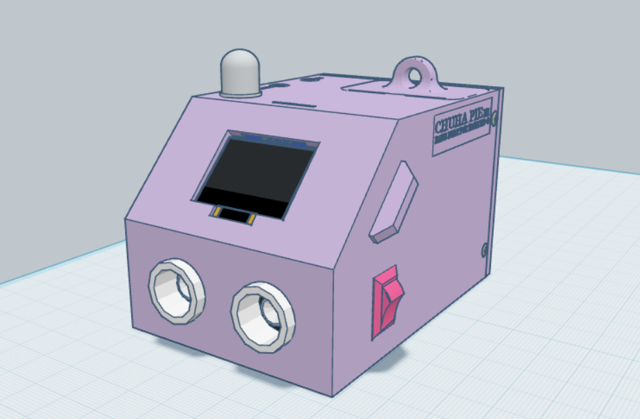

<div align="center">
   
# Chuha Pie V1
*An ESP32-powered animated desk companion with OLED eyes, touch interactions, Spotify controls, presence detection, and environmental monitoring, housed in a custom 3D-printed enclosure.*

[](https://www.espressif.com/)
[](https://www.arduino.cc/)
[](https://isocpp.org/)
[](https://developer.spotify.com/)
[](LICENSE)



</div>

---

## 📖 Table of Contents

- [Overview](#-overview)
- [Repository Structure](#-repository-structure)
- [Hardware](#-hardware)
- [Features](#-features)
- [Pin Connections](#-pin-connections)
- [Libraries Required](#-libraries-required)
- [Getting Started](#-getting-started)
- [Power](#-power)
- [License](#-license)

---

## 🔍 Overview

Chuha Pie V1 is a hand-built desk companion that I built for my girlfriend as her 20th birthday present, which sits on her desk and keeps her company. It uses an OLED display with animated eyes to express its mood, reacts to presence and touch, gives her break and water reminders, tracks and controls Spotify playback on any device using the account, runs a stopwatch and a Pomodoro timer, and measures distance digitally, along with ambient temperature and humidity in the room - all running on an ESP32.

**Key highlights:**

- **Animated OLED eyes** with blink, idle movement, and mood expressions.
- **Touch interactions** - tap, double tap, triple tap, and long press gestures.
- **Presence detection** via HC-SR04  greets and gets excited when it detects presence, gets sad otherwise.
- **Spotify control** - play/pause, next, previous track - through touch controls.
- **Pomodoro timer** with auto-start (10s), pause/resume, and configurable durations from the internal menu.
- **Passive wellness reminders** - posture alerts, break reminders, water reminders via RGB LED.
- **Environmental display** - temperature, humidity, distance readouts on demand
- **Deep sleep via physical switch** - turns off even with USB connected

---

## 📁 Repository Structure

```text
Chuha Pie V1/
├── 📂 3D Print Enclosure/
│   ├── back_plate.stl
│   ├── esp_button_connector.stl
│   └── main_body.stl
|
├── 📂 Main/
│   ├── Main.ino                      # Main firmware
│   └── example_secrets.h             # This is an example file - Upon downloading, rename to secrets.h and follow the instructions.
│
├── 📂 assets/
│   └── device.png                    # 3D render of the device
│
├── .gitignore
├── CMD Serial Monitor.txt            # Use to read serial data from ESP32 in Spotify Mode
├── spotify_get_refresh_token.py      # Helper script to generate Spotify refresh token
├── Chuha Pie User Manual.pdf         # Detailed instructions
├── LICENSE
└── README.md
```

---

## 🪛 Hardware

| Component | Model |
|---|---|
| Microcontroller | ESP32 DevKit V1 |
| Display | SSD1306 128×64 OLED (SPI, 7-pin) |
| Touch Sensor | TTP223 Capacitive Touch |
| Ultrasonic Range Sensor | HC-SR04 |
| Temp/Humidity | DHT11 |
| Indicator | RGB LED (Common Anode, 10mm diffused) |
| Haptics | 5V Vibration Motor Module (3-pin) |
| Sleep Control | SPST Switch (deep sleep via GPIO 35) |
| Power | USB via ESP32 DevKit V1 |

---

## ✨ Features

> See the [User Manual](./Chuha%20Pie%20User%20Manual.pdf) included in the repo for a full visual flowchart of touch interactions.

### Touch Interactions (TTP223)

| Gesture | Action |
|---|---|
| Single tap | Enter Feature Cycle (starts at Date & Time) |
| Double tap | Bonk animation |
| Triple tap | Open Settings |
| Long press (1s) | Cycle to next feature mode |
| Long press (2s+) | Pet the bot — happy animation |
| Long press (4s) | Return to Home Screen from any mode |

### Feature Cycle

**Home → Date & Time → Stopwatch → Pomodoro → Spotify → Distance → Temperature → Humidity → Home**

> **Shortcut**: Long press advances to the next mode. A 4-second long press from any mode jumps directly to home.

| Mode | Single Tap | Double Tap | Triple Tap |
|---|---|---|---|
| Date & Time | Toggle 12h / 24h format | — | — |
| Stopwatch | Start / Pause | Reset | — |
| Pomodoro (select) | Cycle duration options | — | — |
| Pomodoro (running) | Pause / Resume | — | — |
| Spotify | Play / Pause | Next song | Previous song |

### Settings (Triple Tap from Home)

- **Brightness**: 5 levels: 5% / 25% / 50% / 75% / 100%
- **Presence Range** (long press from Brightness): configures detection distance to 30 / 50 / 75 / 100 / 125 cm. The posture alert threshold adjusts proportionally (~40% of the detection distance).

### Automatic / Background Features

| Feature | Trigger | Indicator |
|---|---|---|
| Presence detection | Enters detection range | Greeting eye animation |
| Sad eyes | No presence for 30+ seconds | Eye animation |
| Break reminder | 1 hour of continuous presence | Green LED + vibration |
| Posture alert | Too close for 3+ seconds | Red LED + vibration (1 min cooldown) |
| Water reminder | Every hour / 1 min after 30+ min absence | Blue LED + vibration |
| Sweat animation | Temperature > 35°C | Eye animation (10s every 5 min) |
| Auto brightness | Time of day | 100% (7AM–7PM), 50% (7PM-7AM), 75% (No Internet default) |

---

## 📌 Pin Connections

### OLED Display (SPI)

| OLED Pin | ESP32 Pin |
|---|---|
| GND | GND |
| VDD | 3.3V |
| SCK | GPIO 18 (HSPI CLK) |
| SDA | GPIO 23 (HSPI MOSI) |
| RES | GPIO 4 |
| DC | GPIO 2 |
| CS | GPIO 5 |

### TTP223 Touch Sensor

| Pin | ESP32 Pin |
|---|---|
| VCC | 3.3V |
| GND | GND |
| SIG | GPIO 15 |

### HC-SR04 Ultrasonic Sensor

| Pin | ESP32 Pin |
|---|---|
| VCC | VIN (5V) |
| GND | GND |
| TRIG | GPIO 26 |
| ECHO | Voltage divider → GPIO 27 |

> ⚠️ **HC-SR04 ECHO outputs 5V but ESP32 GPIO is 3.3V tolerant only.**
> Wire a voltage divider on ECHO: `ECHO → 1kΩ → GPIO 27 → 2kΩ → GND` (divides 5V to ~3.3V)

### DHT11

| Pin | ESP32 Pin |
|---|---|
| VCC | 3.3V |
| GND | GND |
| DATA | GPIO 14 |

### RGB LED (Common Anode)

| Pin | ESP32 Pin | Notes |
|---|---|---|
| Anode (longest) | 3.3V | — |
| Red | GPIO 25 | 100Ω resistor in series |
| Green | GPIO 32 | No resistor (Vf ~3.0–3.4V) |
| Blue | GPIO 33 | No resistor (Vf ~3.0–3.4V) |

### Vibration Motor (3-pin module)

| Pin | ESP32 Pin |
|---|---|
| VCC | VIN (5V) |
| GND | GND |
| SIG | GPIO 13 |

### Power Switch

```
GND → 10kΩ → GPIO 35 → [switch] → 3.3V
```

- Switch **open (OFF)**: GPIO 35 reads LOW → ESP32 enters deep sleep
- Switch **closed (ON)**: GPIO 35 reads HIGH → device runs normally

> GPIO 35 is input-only with no internal pull resistor - the external 10kΩ to GND is required.

---

## 📚 Libraries Required

Install via Arduino IDE → **Tools → Manage Libraries**:

| Library | Author |
|---|---|
| `Adafruit SSD1306` | Adafruit |
| `Adafruit GFX Library` | Adafruit |
| `DHT sensor library` | Adafruit |
| `FluxGarage RoboEyes` | FluxGarage |

---

## 🚀 Getting Started

### Prerequisites

- [Arduino IDE](https://www.arduino.cc/en/software) (v1.8+ or v2.x)
- ESP32 board package installed in Arduino IDE
- Python 3.x (for Spotify token helper script)
- A 2.4GHz WiFi network
- Spotify Premium account _(for Spotify feature)_

### 1️⃣ Get the Code

```bash
git clone https://github.com/exorev07/Chuha-Pie-Desk-Companion.git
```

Or download the ZIP from GitHub and extract it.

### 2️⃣ Set Up Arduino IDE

1. Open Arduino IDE → **File → Preferences**
2. Under _Additional Boards Manager URLs_, paste:

   ```text
   https://raw.githubusercontent.com/espressif/arduino-esp32/gh-pages/package_esp32_index.json
   ```

3. Go to **Tools → Board → Boards Manager**, search `esp32`, and install it
4. Go to **Tools → Manage Libraries** and install all four libraries listed above

### 3️⃣ Configure Your Credentials

1. Copy `Main/example_secrets.h.` and rename the copy to `Main/secrets.h`
2. Open `Main/secrets.h` and fill in your details:

   ```cpp
   #define WIFI_SSID_VAL     "Your WiFi Name"
   #define WIFI_PASSWORD_VAL "Your WiFi Password"

   #define SPOTIFY_CLIENT_ID_VAL     "paste_client_id_here"
   #define SPOTIFY_CLIENT_SECRET_VAL "paste_client_secret_here"
   #define SPOTIFY_REFRESH_TOKEN_VAL "paste_refresh_token_here"
   ```

### 4️⃣ Setting Up Spotify

1. Go to [developer.spotify.com/dashboard](https://developer.spotify.com/dashboard) and create an app
2. Set the redirect URI to `http://127.0.0.1:8888/callback`
3. Copy your **Client ID** and **Client Secret** into `secrets.h`
4. Run the included helper script to get your Refresh Token:

   ```bash
   python spotify_get_refresh_token.py
   ```

5. Paste the printed Refresh Token into `secrets.h`

> Chuha Pie V1 can control whichever device is currently active on the Spotify account.

### 5️⃣ Upload to the Device

1. Plug in the device via USB
2. In Arduino IDE: **Tools → Board** → select **ESP32 Dev Module** or **DOIT ESP32 DevKit V1**
3. **Tools → Port** → select the COM port that appears (e.g. COM3 on Windows)
4. Click the **Upload** button (→)
5. If the IDE shows `Connecting...`, hold the **BOOT** button on the ESP32 until uploading starts
6. Wait for _"Done uploading"_ - Chuha Pie restarts automatically

---

## ⚡ Power

- Powered via USB through the ESP32 DevKit V1 
- The physical switch triggers ESP32 **deep sleep**
- To wake: flip the switch to ON (GPIO 35 goes HIGH, ESP32 exits deep sleep and reboots)

---

## 📜 License

This project is licensed under the **MIT License** - see the [LICENSE](LICENSE) file for details.

---

<div align="center">

**⭐ If you like this project, consider giving it a star!**

_Built with 💜 for the love of my life._

</div>

---
